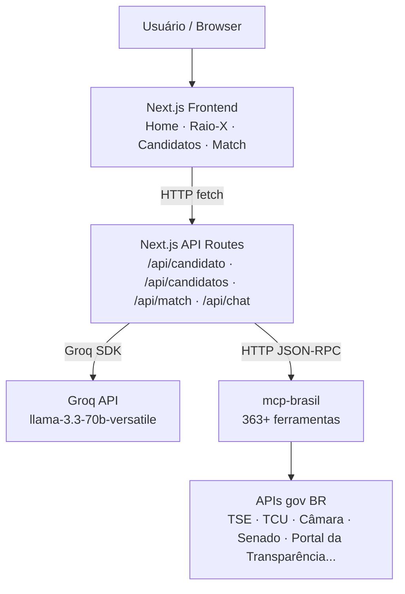

<div align="center">
  

  <h3>Transparência eleitoral com inteligência artificial</h3>
  <p>Plataforma cívica que cruza dados oficiais do governo brasileiro com IA<br/>para ajudar eleitores a conhecer candidatos com base em fatos, não em opiniões.</p>

  <br/>

  
  
  
  
</div>

## Contexto

O **Vote Transparente** é uma plataforma web pública e gratuita onde qualquer eleitor pode pesquisar candidatos e tomar decisões eleitorais com base em dados reais — não em boatos.

**Princípio central:** a IA nunca opina. Ela cruza dados oficiais e explica o que encontrou. Toda informação tem fonte rastreável.

## Funcionalidades

| Funcionalidade | Rota | Descrição |
|---|---|---|
| Raio-X do Candidato | `/candidato` | Relatório completo: candidaturas, financiamento, histórico parlamentar, processos no TCU, gastos de mandato e anúncios pagos em redes sociais |
| Explorar por Cargo | `/candidatos` | Listagem de candidatos filtrada por cargo, estado, município e ano de eleição |
| Match de Valores | `/match` | Questionário de prioridades temáticas com recomendação fundamentada em dados |

## Arquitetura



**Fluxo de uma consulta:**
1. Usuário digita o nome de um candidato ou seleciona filtros
2. Next.js envia a pergunta para a API Route correspondente
3. A API Route aciona o Groq com as ferramentas disponíveis no MCP Brasil
4. O modelo decide quais ferramentas chamar (TSE, Transparência, TCU, etc.)
5. O servidor `mcp-brasil` consulta as APIs oficiais e retorna os dados
6. O modelo sintetiza e apresenta a resposta com as fontes citadas

## Tecnologias

| Categoria | Tecnologia |
|---|---|
| Framework | [Next.js 16](https://nextjs.org) (App Router) + TypeScript 5 |
| UI | [Tailwind CSS v4](https://tailwindcss.com) + [shadcn/ui](https://ui.shadcn.com) + [Lucide React](https://lucide.dev) |
| IA | [Groq API](https://groq.com) — modelo `llama-3.3-70b-versatile` com function calling |
| Dados gov. | [mcp-brasil](https://github.com/jxnxts/mcp-brasil) — 363+ ferramentas conectadas a APIs oficiais |

## Pré-requisitos

- **Node.js** 20 ou superior — [nodejs.org](https://nodejs.org)
- **Python** 3.11 ou superior — [python.org](https://python.org) *(para rodar o mcp-brasil localmente)*
- **Git** — [git-scm.com](https://git-scm.com)
- Chave de API da **Groq** — [console.groq.com](https://console.groq.com) *(gratuita)*

## Variáveis de Ambiente

Crie um arquivo `.env.local` na raiz do projeto:

```env
# Obrigatória — motor de IA da aplicação
GROQ_API_KEY=sua_chave_aqui

# URL do servidor MCP Brasil
MCP_BRASIL_URL=http://localhost:8000

# Opcionais — ampliam as ferramentas disponíveis no MCP Brasil
TRANSPARENCIA_API_KEY=sua_chave_aqui   # portaldatransparencia.gov.br/api-de-dados
DATAJUD_API_KEY=sua_chave_aqui         # datajud.cnj.jus.br
META_ACCESS_TOKEN=seu_token_aqui       # developers.facebook.com (Ad Library API)
```

> O `.env.local` nunca deve ser enviado ao GitHub — já está no `.gitignore` por padrão.

Sem as variáveis opcionais a aplicação funciona normalmente. As ferramentas que dependem delas ficam indisponíveis; as demais 38+ APIs abertas do MCP Brasil continuam ativas.


## Como Executar Localmente

**1. Clonar o repositório**

```bash
git clone https://github.com/barbarapac/vote-transparente.git
cd vote-transparente
```

**2. Instalar dependências**

```bash
npm install
```

**3. Configurar variáveis de ambiente**

Crie o `.env.local` conforme a seção acima com pelo menos `GROQ_API_KEY`.

**4. Subir o servidor mcp-brasil**

Em um terminal separado:

```bash
pip install mcp-brasil
fastmcp run mcp_brasil.server:mcp --transport http --port 8000
```

Confirme que está rodando acessando `http://localhost:8000`.

**5. Rodar a aplicação**

```bash
npm run dev
```

Acesse [http://localhost:3000](http://localhost:3000) no navegador.

## Scripts

| Script | Descrição |
|---|---|
| `npm run dev` | Servidor de desenvolvimento |
| `npm run build` | Build de produção |
| `npm run start` | Executa o build de produção |
| `npm run lint` | Linting com ESLint |


## Fontes de Dados

| Fonte | Categoria | O que consulta |
|---|---|---|
| [TSE](https://dadosabertos.tse.jus.br) | Eleitoral | Candidaturas, financiamento, resultados de eleições |
| [Portal da Transparência](https://portaldatransparencia.gov.br) | Gastos públicos | Contratos, sanções, gastos de mandato |
| [Câmara dos Deputados](https://dadosabertos.camara.leg.br) | Legislativo | Votações, cota parlamentar, projetos de lei |
| [Senado Federal](https://dadosabertos.senado.leg.br) | Legislativo | Matérias, votações, comissões |
| [TCU / TCE](https://portal.tcu.gov.br) | Auditoria | Processos, dívidas, entidades punidas |
| [CNJ / DataJud](https://datajud.cnj.jus.br) | Jurídico | Processos judiciais |
| [Meta Ad Library](https://www.facebook.com/ads/library) | Publicidade | Anúncios políticos pagos no Facebook e Instagram |

Todas as consultas são feitas via [mcp-brasil](https://github.com/jxnxts/mcp-brasil), servidor MCP open-source com 363+ ferramentas.


## Licença

MIT
